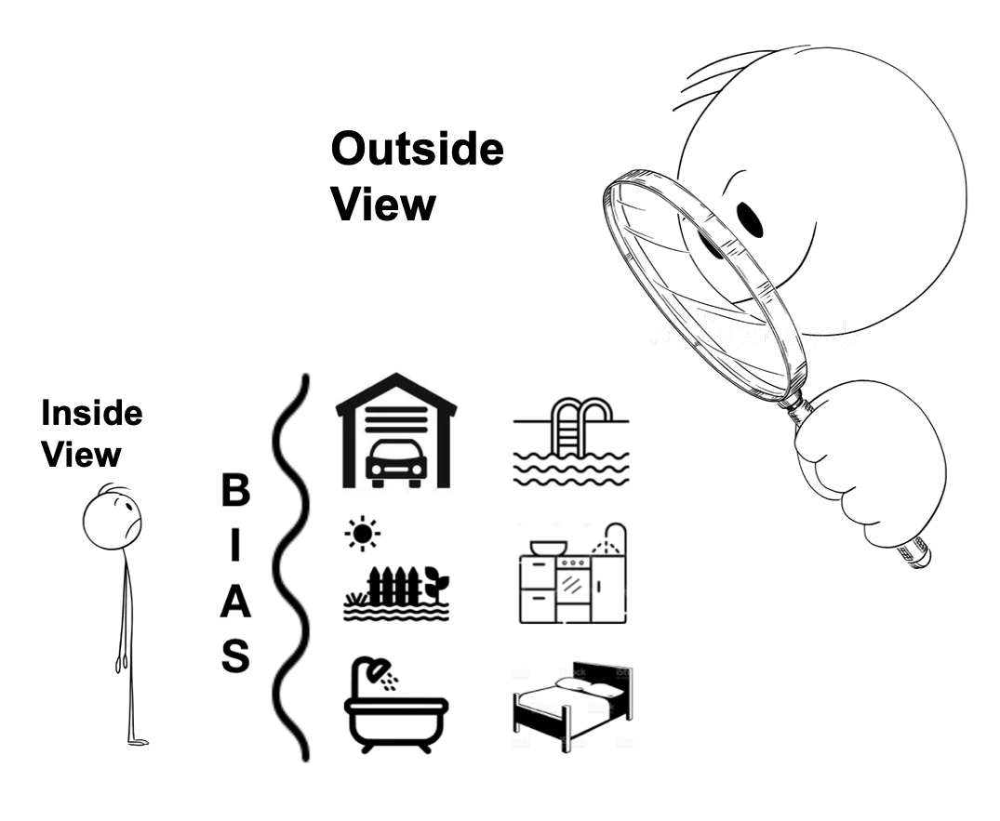

# Project 2 - Predicting Real Estate Sales Price in Ames

## Table of Contents
1. Problem Statement
2. Data Cleaning and EDA
3. Preprocessing and Modelling
4. Chosen Model Evalutation on Test Data
5. Conclusions and Reccomendations

## Introduction
Trying to accurately predict the price of a real estate is tricky business. This can often lead to disagreements between home-buyers, home-sellers and real estate agents, which be distressing for all parties involved.

 

**The reason it can be difficult to accurately predict the price of real estate is because there are many features in a house that will affect it's sale price.**

Many people base their predictions of house sale price on an **Inside View**.
The **Inside View** on a topic involves making predictions based on your understanding of the details of the process which can be easily skewed by personal biases!

What we truly need for this issue of housing sale price predictions is an **Outside View**.
The **Outside View** involves ignoring these details and using an estimate based on a class of roughly similar previous cases, and is a clearer, more unbiased approach to the problem at hand.

 

# 1. Problem Statement

There are are many variables that determine how much a home can fetch.

Using the Ames (IA) dataset (train, test), we want to find out which variables matter for home sale prices and produce accurate sale price predictions.

In this study, we will develop a model will provide the **Outside View**, helping to reduce information asymmetry between potential home-buyers, home-sellers and real estate agents.

Success will be determined by how well the model predicts the sale price of the test data set submitting the predicted sales price to Kaggle at https://www.kaggle.com/c/dsi-us-11-project-2-regression-challenge.

# 2. Data Cleaning and EDA
## The Data Dictionary
|Feature|Type|Description|
|---|---|---|
|**SalePrice**|*float64*|the property's sale price in dollars.|  
|**MSSubClass**|*Object*|The building class.|  
|**MSZoning**|*Object*|Identifies the general zoning classification of the sale.|  
|**LotFrontage**|*float4*|Linear feet of street connected to property|  
|**LotArea**|*float64*|Lot size in square feet.|   
|**Street**|*Object*|Type of road access to property.|   
|**Alley**|*Object*|Type of alley access to property.|   
|**LotShape**|*Object*|General shape of property|   
|**LandContour**|*Object*|Flatness of the property|    
|**Utilities**|*Object*|Type of utilities available|   
|**LotConfig**|*Object*|Lot configuration|   
|**LandSlope**|*Object*|Slope of property|   
|**Neighborhood**|*Object*|Physical locations within Ames city limits|   
|**Condition1**|*Object*|Proximity to main road or railroad|  
|**Condition2**|*Object*|Proximity to main road or railroad (if a second is present)|  
|**BldgType**|*Object*|Type of dwelling|  
|**HouseStyle**|*Object*|Style of dwelling|  
|**OverallQual**|*int64*|Overall material and finish quality|  
|**OverallCond**|*int64*|Overall condition rating|  
|**YearBuilt**|*int64*|Original construction date|  
|**YearRemodAdd**|*int64*|Remodel date (same as construction date if no remodeling or additions)|  
|**RoofStyle**|*Object*|Type of roof|  
|**RoofMatl**|*Object*|Roof material|  
|**Exterior1st**|*Object*|aExterior covering on house|  
|**Exterior2nd**|*Object*|Exterior covering on house (if more than one material)|  
|**MasVnrType**|*Object*|Masonry veneer type|  
|**MasVnrArea**|*int64*|Masonry veneer area in square feet|  
|**ExterQual**|*Object*|Exterior material quality|  
|**ExterCond**|*Object*|Present condition of the material on the exterior|  
|**Foundation**|*Object*|Type of foundation|  
|**BsmtQual**|*Object*|Height of the basement|  
|**BsmtCond**|*Object*|General condition of the basement|  
|**BsmtExposure**|*Object*|Walkout or garden level basement walls|  
|**BsmtFinType1**|*Object*|Quality of basement finished area|  
|**BsmtFinSF1**|*int64*|Type 1 finished square feet|  
|**BsmtFinType2**|*Object*|Quality of second finished area (if present)|  
|**BsmtFinSF2**|*int64*|Type 2 finished square feet|  
|**BsmtUnfSF**|*int64*|Unfinished square feet of basement area|  
|**TotalBsmtSF**|*int64*|Total square feet of basement area|  
|**Heating**|*Object*|Type of heating|  
|**HeatingQC**|*Object*|Heating quality and condition|  
|**CentralAir**|*Object*|Central air conditioning|  
|**Electrical**|*Object*|Electrical system|  
|**1stFlrSF**|*int64*|First Floor square feet|  
|**2ndFlrSF**|*int64*|Second floor square feet|  
|**LowQualFinSF**|*int64*|Low quality finished square feet (all floors)|  
|**GrLivArea**|*int64*|Above grade (ground) living area square feet|  
|**BsmtFullBath**|*int64*|Basement full bathrooms|  
|**BsmtHalfBath**|*int64*|Basement half bathrooms|  
|**FullBath**|*int64*|Full bathrooms above grade|  
|**HalfBath**|*int64*|Half baths above grade|  
|**Bedroom**|*int64*|Number of bedrooms above basement level|  
|**Kitchen**|*int64*|Number of kitchens|  
|**KitchenQual**|*Object*|Kitchen quality|  
|**TotRmsAbvGrd**|*int64*|Total rooms above grade (does not include bathrooms)|  
|**Functional**|*Object*|Home functionality rating|  
|**Fireplaces**|*int64*|Number of fireplaces|  
|**FireplaceQu**|*Object*|Fireplace quality|  
|**GarageType**|*Object*|Garage location|  
|**GarageYrBlt**|*int64*|Year garage was built|  
|**GarageFinish**|*Object*|Interior finish of the garage|  
|**GarageCars**|*int64int64*|Size of garage in car capacity|  
|**GarageArea**|*int64*|Size of garage in square feet|  
|**GarageQual**|*Object*|Garage quality|  
|**GarageCond**|*Object*|Garage condition|  
|**PavedDrive**|*Object*|Paved driveway|  
|**WoodDeckSF**|*int64*|Wood deck area in square feet|  
|**OpenPorchSF**|*int64*|Open porch area in square feet|  
|**EnclosedPorch**|*int64*|Enclosed porch area in square feet|  
|**3SsnPorch**|*int64*|Three season porch area in square feet|  
|**ScreenPorch**|*int64*|Screen porch area in square feet|  
|**PoolArea**|*int64*|Pool area in square feet|  
|**PoolQC**|*Object*|Quality of pool|  
|**Fence**|*Object*|Fence quality|  
|**MiscFeature**|*Object*|Miscellaneous feature not covered in other categories|  
|**MiscVal**|*int64*|$Value of miscellaneous feature|  
|**MoSold**|*int64*|Month Sold|  
|**YrSold**|*int64*|Year Sold|  
|**SaleType**|*Object*|Type of sale|  
## Data cleaning is split into:
### 2.1 Converting year that the house, additions/remodelling and garage was built, to actual age.
- Achieved by using: Year Sold - Year Built

### 2.2 Converting ordinal values such as External Quality and Garage Condition to scale with this format:
- NaN: 0
- 'Po': 1
- 'Fa': 2
- 'TA': 3
- 'Gd': 4
- 'Ex': 5

### 2.3 Imputing the null values
- Numerical Features in Train Set
  - Lot Frontage
    - The higher the lot frontage, the higher the sale price of the house.
    - There are 330 null values in Lot Frontage. That is **more than 15%** of the train entire dataset.
    - These nulls are due to no street connected to the property.
    - Nulls in Lot Frontage will be imputed with the median as a best compromise, as imputing with 0 will skew the predicted sale price.
  - Garage Age
    - The lower the age of the garage, the higher the sale price of the house.
    - There are 114 null values in Garage Age. That is **slightly over 5%** of the entire train dataset.
    - These nulls are due to the house not having a garage.
    - Nulls in Garage Age will be imputed with the median as a best compromise, as imputing with 0 will skew the predicted sale price.
  - The rest of the null values in numerical features will be imputed with 0, as a null value indicates that the feature simply does not exists for that house.

- Categorical Features in Train Set
  - Null values in categorical features indicated that the feature does not exist, and are thus imputed with 'None'.

- Numerical and Categorical nulls in the test set are imputed in the same way as the train set, except for electrical in the test set:
  - Null value imputed with the mode, as there was only 1 null value in electrical in the test set.

- Removing Outliers
  - Numerical Outliers
    - Outliers such as those circled in the figure below are removed

      

  - Categorical "Outliers"
    - Drop features in the test set that have values that are not present in the train set, as the model will not be able to predict the sale price of the test set from values that it was never trained on.
    - For features in train set with values that are not present in the test set, we will drop those rows in the train set with these values, as they will add no value to the model when predicting the test set.

## Feature Selection
- Numerical Feature Selection
 - Performing a correlation test on the train set and picking those features whereby:
 **Pearson's Correlation > 0.3** or **Pearson's Correlation < -0.3**
 - We have 'overall_qual', 'exter_qual', 'gr_liv_area', 'kitchen_qual', 'garage_area', 'garage_cars', 'total_bsmt_sf', '1st_flr_sf', 'bsmt_qual', 'fireplace_qu', 'full_bath', 'totrms_abvgrd', 'mas_vnr_area', 'fireplaces', 'heating_qc', 'bsmtfin_sf_1', 'open_porch_sf', 'wood_deck_sf', 'lot_frontage', 'garage_age', 'reno_age', 'house_age'.

- Categorical Feature Selection
 - After dropping those features in the test set that have values that are not present in the train set, we are left with 'ms_zoning', 'street', 'alley', 'lot_shape', 'land_contour', 'utilities', 'lot_config', 'land_slope', 'neighborhood', 'condition_1', 'condition_2', 'bldg_type', 'house_style', 'roof_style', 'foundation', 'bsmt_exposure', 'bsmtfin_type_1', 'bsmtfin_type_2', 'central_air', 'electrical', 'functional', 'garage_type', 'garage_finish', 'paved_drive', 'fence', 'misc_feature'.

# 3. Preprocessing and Modelling
## Target variable **'y'**
The target variable will be the Sale Price, and from the figure below, it is right skewed.

 

We will improve on this by applying a log function to the Sale Price, like so:

 

We can see that curve has become a lot smoother, with mean and median are much closer to the peak of the distribution curve.

## The Features **'X'**
- Convert the categorical features to dummies.
- Scale the features

## Modelling
After performing train, test and split on the X and y
- 1 baseline was run:
  - Using the mean value of the sale price training **y**.
- 3 models were run:
  - Simple Linear
  - LASSO
  - RIDGE
- The metrics used to evaluate each model's will be:
- Root Mean Squared Error (RMSE) of the actual sales price and predicted sales price.
    - Low RMSE is better, as it means that the predicted price is closer to the actual sale price
- R2 Score on the model
    - R2 Score greater than 0.85 is preferred - the closer the R2 score is to 1, the more accurate the model is at predicting the sale price

The results were as follows:
||RMSE|R2|
|--|---|---|
|**Baseline**|79,926.55|-0.0025|
|**Simple Linear**|22,673.71|0.876|
|**LASSO**|22,006.79|0.890|
|**RIDGE**|22,350.20|0.883|

From the table, we can rank (1 - 4) and choose the best model:
1. LASSO (BEST!)
2. RIDGE
3. Simple Linear
4. Baseline (WORST!)

LASSO is the best as it acts as a feature selector, and shrinks the coefficients of those features that are not relevant to 0.

We will select LASSO Regression as the model to test the Test Data, and also investigate which features are a good predictor of sale price, so that home sellers/buyers and real-estate agents can easily predict the value of a house.

Based on the residual plot below, we can see that this chosen LASSO model will perform best when having to predict houses within the range of USD 100k to USD 300k, as indicated by the larger cluster of lower RMSE values in that range.
  

# 4. Chosen Model Evaluation on Test Data
Before we can run the use the model on the test data, we need to retrain it on the entire train set so as to ensure the model gets the trained and exposed to the full train set.

After retraining, the model was used to predict the sale price of
the test data, and the predictions were submitted to the Kaggle page.

## Kaggle Submission
The Kaggle score is based on the root-mean-squared-error. The results were:
- Private Score: 19429.76200
- Public Score: 21205.90332

This puts our model in the top 10 of the leaderboard, of which there were 89 entries. This indicates that that this model is a good predictor of the sale price of houses in Ames!

  

# Conclusions and Recommendations
The LASSO Regression Model was the best model for the job overall based on R2 Score and RMSE.

This model will perform best when having to predict houses within the range of USD 100k to USD 300k.

Using this LASSO model, we are able to effectively predict the sale price for our home owners, potential buyers, and real estate agents alike.

When exploring the coefficients of the LASSO model, it is found that:

5 strongest features that are **directly proportional** to the house sale price are:
- **gr_liv_area**: Above grade (ground) living area square feet
- **overall_qual**: Overall material and finish quality
- **ms_zoning_RL**: Residential Low Density
- **ms_zoning_RM**: Residential Medium Density
- **ms_zoning_FV**: Floating Village Residential

and the 5 strongest features that are **inversely proportional** to the house sale price are:
- **bldg_type_TwnhsE**: Townhouse End Unit
- **bldg_type_Twnhs**:Townhouse Inside Unit
- **bsmtfin_type_1_Unf**: Unfinshed basement
- **house_age**: The age of the house when it was sold
- **reno_age**: The age of remodeling or additions done to the house when it was sold

Should these home owners, potential buyers and real estate agents want a quick 'guesstimate' of the house sale price, they can make a quick judgement based on the following:
- What is the total size in square feet of the living area of the house
- What is the overall material and finish quality
- Where the house is located (areas of lower housing density tend to fetch higher prices)
- What type of building the house is (family detached homes tend to fetch higher prices)
- Whether the basement is habitable (Unfinished basements tend to fetch lower prices)
- The age of the house and the renovation works done (Newer houses or more recent renovation works tend to fetch higher prices)
